# News Aggregator Software Design Project

## Introduction

Welcome to the Software System Design project for the News Aggregator application! In this project, I'm showcasing the design and implementation of a web-based platform, BARN, that aggregates news from various RSS feeds, delivering a distraction-free, personalized, and user-friendly experience. Designed as part of the SWENG 837 course, this document and its accompanying deliverables aim to demonstrate a comprehensive software design lifecycle—from defining the problem to crafting an optimal solution using Object-Oriented Analysis and Design (OOAD) principles, domain modeling, and industry-standard design patterns.

BARN addresses the modern need for quick, clutter-free news consumption by providing users with curated content based on their preferences, free from advertisements and unnecessary features. Built with a modern tech stack including SvelteKit, Node.js, and CockroachDB, and hosted on scalable cloud platforms like Netlify, this project balances functionality, performance, and maintainability.

In the sections that follow, we’ll explore the problem statement, system requirements, UML diagrams, architectural components, and more.

## Contents

1. [Problem Statement and Requirements](#problem-statement-and-requirements)
   - Business Requirements
   - Non-Functional Requirements
2. [UML Use Case Diagram](#uml-use-case-diagram)
3. [UML Domain Model](#uml-domain-model)
4. [UML Class Diagram](#uml-class-diagram)
5. [UML Sequence Diagrams](#uml-sequence-diagrams)
6. [UML State Diagram](#uml-state-diagram)
7. [UML Activity Diagram (Swimlane Diagram)](#uml-activity-diagram-swimlane-diagram)
8. [UML Component Diagram](#uml-component-diagram)
9. [Cloud Deployment Diagram](#cloud-deployment-diagram)
10. [Skeleton Classes and Tables Definition](#skeleton-classes-and-tables-definition)
11. [Design Patterns](#design-patterns)

## Problem Statement and Requirements

### Business Requirements

The Barn application is designed to solve the problem of cluttered, ad-heavy, and time-consuming news consumption in today’s digital landscape. Modern news platforms often overwhelm users with long-form content, advertisements, pop-ups, and irrelevant articles, leading to decision fatigue and disengagement, especially among younger demographics like millennials and Gen Z. This system aims to provide a streamlined, distraction-free platform that aggregates news from various RSS feeds and tailors it to individual user preferences, enhancing readability and engagement.

**Functionalities the System Needs to Provide:**

- **User Onboarding**: Allow users to sign up or sign in using Google OAuth, followed by an onboarding flow where they can select topics of interest (e.g., technology, sports, politics) and optionally choose cities for weather-related news. These preferences are saved to personalize their feed.
- **News Feed Aggregation**: Pull content from multiple RSS feeds based on user-selected topics, updating the feed daily with fresh articles. Display a "You're all done for today" message when all new content is consumed, followed by older articles if desired.
- **Content Interaction**: Enable users to save articles for later reading, provide thumbs-up/thumbs-down feedback to refine recommendations, and offer a limited audio feature for accessibility (e.g., text-to-speech for articles).
- **Cross-Platform Access**: Deliver the app as a web application accessible on any modern browser, with Progressive Web App (PWA) support for mobile devices, ensuring a seamless experience across platforms without requiring native app development.
- **Recommendation Engine**: Use machine learning to analyze user interactions (e.g., time spent on articles, feedback) and improve content suggestions over time.

**Target Users and Their Needs:**

- **Demographic**: 18-45 years old, primarily English-speaking users globally, including casual news readers, students, professionals, and tech-savvy individuals from middle to upper-middle-class backgrounds with access to smartphones or computers.
- **Needs**: Users need a quick, efficient way to stay informed without distractions. They value concise summaries, personalized content, and the ability to save articles for later, fitting their busy, fast-paced lifestyles. Accessibility features like audio playback cater to users with visual impairments or multitasking preferences.

**Business Goals:**

- Increase user engagement by providing a clean, ad-free experience that encourages daily usage.
- Build trust by avoiding paywalls, pop-ups, and intrusive ads, aligning with Gen Z preferences (as per Jigsaw’s survey).
- Establish a scalable platform that can grow its user base and content sources over time, potentially integrating additional features like weather updates or social sharing in future iterations.

### Non-Functional Requirements

**Performance Requirements:**

- **Scalability**: The system must handle an initial load of 100 concurrent users, with the ability to scale to 10,000 and eventually 100,000 concurrent users as adoption grows. This is achieved through stateless authentication and cloud hosting on platforms like Netlify.
- **Response Time**: API endpoints (e.g., fetching news feeds, saving preferences) should respond in less than 100ms under normal load, with a target of 30ms for critical operations like feed refreshes to ensure a snappy user experience.
- **Throughput**: Support at least 1,000 requests per minute initially, scaling to 100,000 requests per minute for larger user bases, facilitated by efficient database queries and CDN caching.

**Security Requirements:**

- **Authentication**: Use Google OAuth 2.0 for secure user login, ensuring credentials are managed by Google and not stored locally.
- **Authorization**: Restrict access to protected routes (e.g., /app) to authenticated users only, validated via session cookies.
- **Data Encryption**: Enforce HTTPS for all client-server communications, with cookies set as HttpOnly and Secure to prevent XSS and man-in-the-middle attacks. User data in CockroachDB should be encrypted at rest.

**Maintainability Requirements:**

- **Code Modularity**: Leverage SvelteKit’s routing and file-based structure to separate frontend, backend, and data logic (e.g., load functions, form actions, API endpoints), making it easy to update individual components.
- **Documentation**: Provide comprehensive API documentation via Swagger, a README.md in the GitHub repository, and inline code comments to aid future developers.
- **Testing Strategies**: Implement automated unit tests for backend logic (e.g., OAuth flow, feed aggregation) and integration tests for API endpoints, ensuring reliability during updates.

**Other Non-Functional Requirements:**

- **Reliability**: Achieve 99.9% uptime by using a distributed database like CockroachDB and hosting on Netlify/AWS, with failover handled via cloud redundancy. Handle errors gracefully (e.g., redirect to sign-in on auth failure).
- **Usability**: Ensure a consistent, intuitive UI following Apple’s Human Interface Guidelines, with clear feedback on actions (e.g., saving preferences) and minimal learning curve for new users.
- **Accessibility**: Support WCAG 2.1 guidelines, including audio features for articles and keyboard navigation for all interactive elements.
- **Cost Efficiency**: Minimize operational costs by using serverless functions and a monolithic architecture initially, avoiding the overhead of separate microservices until scale demands it.

## UML Use Case Diagram

This UML Use Case Diagram for Barn gives a high-level visual representation of the system's actors and their interactions with the application. This diagram helps stakeholders understand how users and external systems engage with Barn to achieve its core functionalities, such as reading personalized news, managing preferences, and providing feedback.

Below is the PlantUML for the Use Case Diagram, followed by a detailed explanation of each component.


<details>
<summary>Click to Expand: PlantUML code</summary>

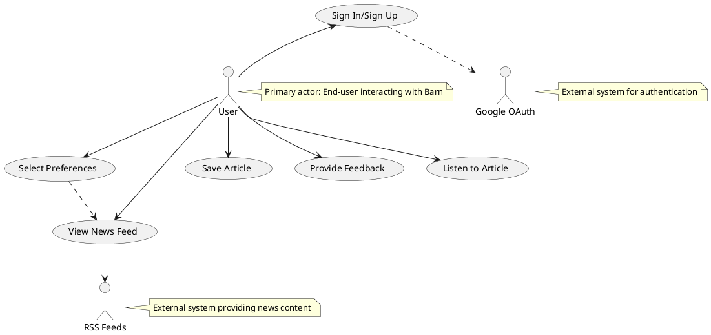

</details>

### Diagram Explanation

- **Actors**:

  - **User**: The primary actor, representing the target audience (18-45-year-olds, casual news readers, students, professionals, etc.) who interact with Barn to consume news and manage their experience.
  - **Google OAuth**: An external system actor responsible for handling user authentication via Google’s OAuth 2.0 protocol.
  - **RSS Feeds**: An external system actor representing the various news sources that Barn aggregates content from.

- **Use Cases**:

  - **Sign In/Sign Up**: Users authenticate using Google OAuth to access Barn’s personalized features. This is the entry point to the app.
  - **Select Preferences**: Users choose topics of interest (e.g., technology, sports) and optionally cities for weather during onboarding or later updates, shaping their news feed.
  - **View News Feed**: Users browse a curated feed of news articles pulled from RSS feeds based on their preferences, updated daily.
  - **Save Article**: Users can bookmark articles for later reading, storing them in their profile.
  - **Provide Feedback**: Users give thumbs-up or thumbs-down on articles, refining the recommendation engine.
  - **Listen to Article**: Users activate the audio feature to have articles read aloud, enhancing accessibility.

- **Relationships**:
  - The User interacts directly with all use cases, reflecting their central role in Barn’s functionality.
  - **Sign In/Sign Up** extends to **Google OAuth**, indicating reliance on an external system for authentication.
  - **View News Feed** depends on **RSS Feeds** for content, showing the integration with external news sources.
  - **Select Preferences** influences **View News Feed**, as preferences determine the content displayed.

## UML Domain Model

This UML Domain Model for Barn helps us identify the key entities and their relationships within the problem domain, independent of any specific technology or implementation details. This model focuses on the conceptual structure of the news aggregation system, capturing the essential objects and their interactions to represent the core problem of delivering personalized, distraction-free news. Below is the PlantUML for the Domain Model, followed by a detailed explanation.

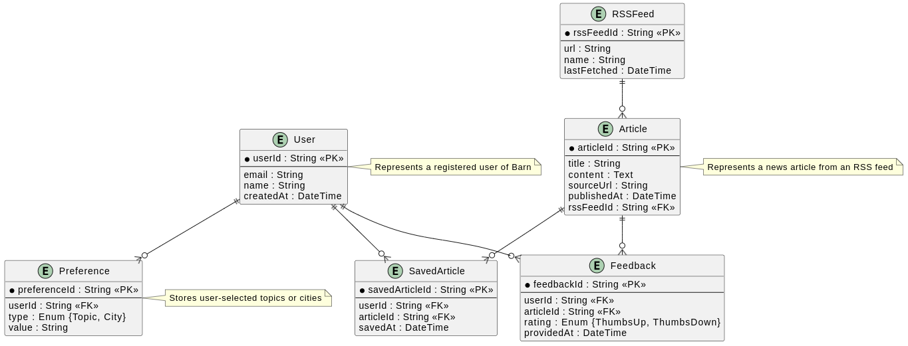

<details>
<summary>Click to Expand: PlantUML code</summary>

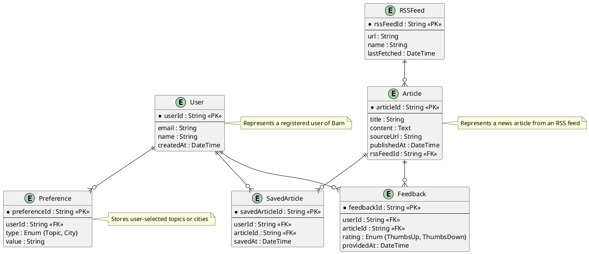

</details>

### Diagram Explanation

- **Entities**:

  - **User**: The central entity representing a Barn user, identified by a unique `userId`. Attributes include `email` and `name` (from Google OAuth) and `createdAt` for tracking account creation.
  - **Preference**: Captures a user’s interests, such as topics (e.g., "Technology") or cities (e.g., "New York"), linked to a `userId`. The `type` field distinguishes between topic and city preferences.
  - **Article**: Represents a news article aggregated from an RSS feed, with attributes like `title`, `content`, `sourceUrl`, and `publishedAt`. It’s tied to an `rssFeedId`.
  - **RSSFeed**: Models an external RSS feed source, identified by `rssFeedId`, with details like `url`, `name`, and `lastFetched` to track updates.
  - **SavedArticle**: Represents an article a user has saved, linking `userId` and `articleId`, with a `savedAt` timestamp.
  - **Feedback**: Captures user feedback (thumbs-up or thumbs-down) on an article, linking `userId` and `articleId`, with a `providedAt` timestamp.

- **Relationships**:

  - **User to Preference (1:N)**: One user can have multiple preferences (e.g., multiple topics or cities), represented by a one-to-many relationship.
  - **User to SavedArticle (1:N)**: A user can save multiple articles, another one-to-many link.
  - **User to Feedback (1:N)**: A user can provide feedback on multiple articles.
  - **Article to SavedArticle (1:N)**: One article can be saved by multiple users.
  - **Article to Feedback (1:N)**: One article can receive feedback from multiple users.
  - **RSSFeed to Article (1:N)**: One RSS feed can provide multiple articles.

- **Keys**:
  - Primary Keys (PK): Unique identifiers for each entity (e.g., `userId`, `articleId`).
  - Foreign Keys (FK): Link entities, such as `userId` in `Preference` or `rssFeedId` in `Article`.

## UML Class Diagram

This UML Class Diagram for Barn translates the conceptual Domain Model into a detailed, implementation-ready set of classes, including attributes, methods, and relationships that reflect the system's functionality. This diagram bridges the gap between the problem domain and the technical design, providing a blueprint for developers to build the application using Object-Oriented principles. Below is the PlantUML for the Class Diagram, followed by a detailed explanation.

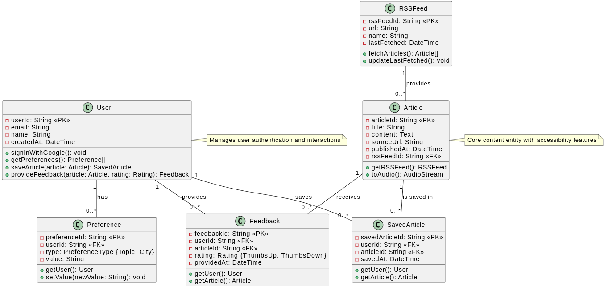

<details>
<summary>Click to Expand: PlantUML code</summary>

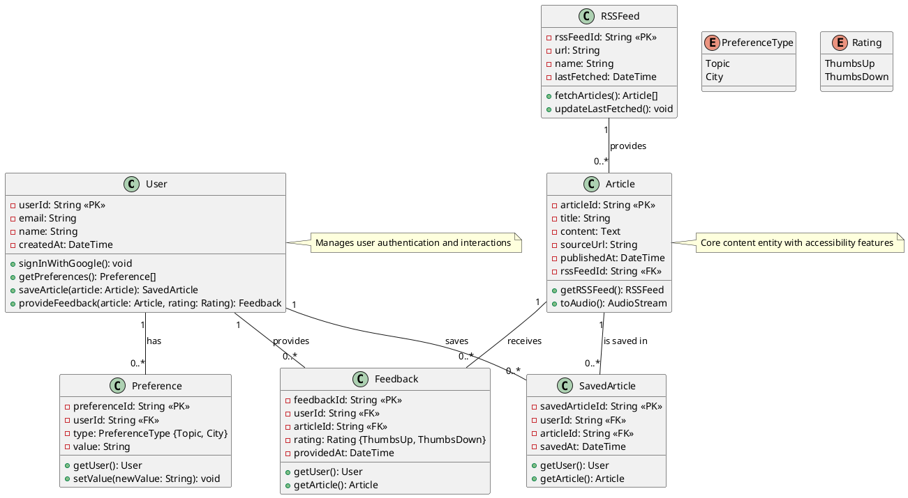

</details>

### Diagram Explanation

- **Classes and Attributes**:

  - **User**: Represents a Barn user with private attributes (`-` prefix) like `userId` (primary key), `email`, `name`, and `createdAt`. Public methods (`+` prefix) include authentication and interaction functions.
  - **Preference**: Stores user preferences with `preferenceId` (PK), `userId` (FK), `type` (enum for Topic or City), and `value` (e.g., "Technology" or "New York").
  - **Article**: Models a news article with `articleId` (PK), content details, and `rssFeedId` (FK), plus a method to convert content to audio.
  - **RSSFeed**: Represents an RSS feed source with `rssFeedId` (PK), `url`, `name`, and `lastFetched`, including methods to fetch articles.
  - **SavedArticle**: Links users and articles they save, with `savedArticleId` (PK), `userId` (FK), `articleId` (FK), and `savedAt`.
  - **Feedback**: Captures user feedback with `feedbackId` (PK), `userId` (FK), `articleId` (FK), `rating` (enum), and `providedAt`.

- **Enums**:

  - **PreferenceType**: Defines valid types for preferences (Topic or City).
  - **Rating**: Defines feedback options (ThumbsUp or ThumbsDown).

- **Methods**:

  - **User**: `signInWithGoogle()` initiates OAuth login, `getPreferences()` retrieves preferences, `saveArticle()` and `provideFeedback()` manage user actions.
  - **Preference**: `getUser()` retrieves the associated user, `setValue()` updates the preference.
  - **Article**: `getRSSFeed()` links to the source, `toAudio()` generates an audio stream.
  - **RSSFeed**: `fetchArticles()` retrieves new articles, `updateLastFetched()` tracks updates.
  - **SavedArticle** and **Feedback**: `getUser()` and `getArticle()` provide relational access.

- **Relationships**:
  - **User to Preference (1:N)**: A user has multiple preferences.
  - **User to SavedArticle (1:N)**: A user can save multiple articles.
  - **User to Feedback (1:N)**: A user can provide feedback on multiple articles.
  - **Article to SavedArticle (1:N)**: An article can be saved by multiple users.
  - **Article to Feedback (1:N)**: An article can receive feedback from multiple users.
  - **RSSFeed to Article (1:N)**: An RSS feed provides multiple articles.

## UML Sequence Diagrams

This UML Sequence Diagrams for Barn illustrate the dynamic interactions between objects during key use cases, showing the message flow and sequence of operations over time. These diagrams are essential for understanding how Barn’s components collaborate to deliver its functionality. Below, I’ve included PlantUML for two critical use cases: **User Sign-In with Google OAuth** and **Viewing the News Feed**, followed by explanations.

### Sequence Diagram 1: User Sign-In with Google OAuth

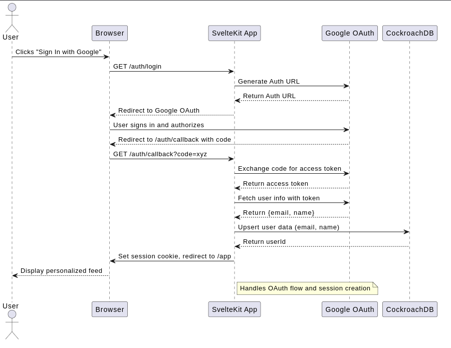

<details>
<summary>Click to Expand: PlantUML code</summary>

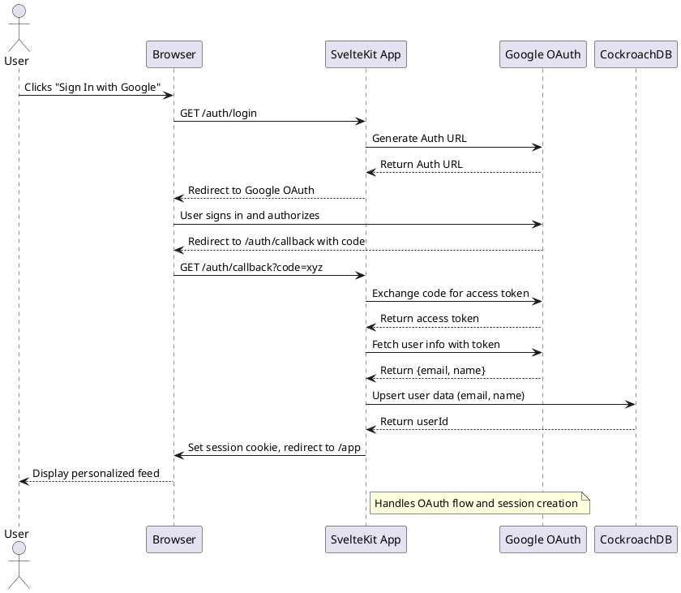

</details>

#### Explanation

- **Actors and Participants**: The User interacts via the Browser, which communicates with the SvelteKit App (Barn’s core), Google OAuth (external authentication), and CockroachDB (data storage).
- **Flow**:
  1. The User clicks "Sign In with Google" in the Browser.
  2. The Browser requests the login endpoint from the App.
  3. The App generates an OAuth URL with Google and redirects the Browser.
  4. The User authenticates with Google, which redirects back to the App with an authorization code.
  5. The App exchanges the code for an access token, fetches user info (e.g., email, name), and upserts it into CockroachDB.
  6. The App sets a session cookie and redirects the Browser to the personalized feed.
- **Purpose**: This diagram shows the authentication flow, emphasizing security (OAuth) and session management, crucial for Barn’s user onboarding.

### Sequence Diagram 2: Viewing the News Feed

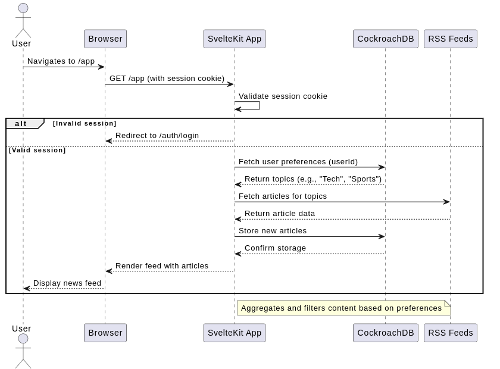

<details>
<summary>Click to Expand: PlantUML code</summary>

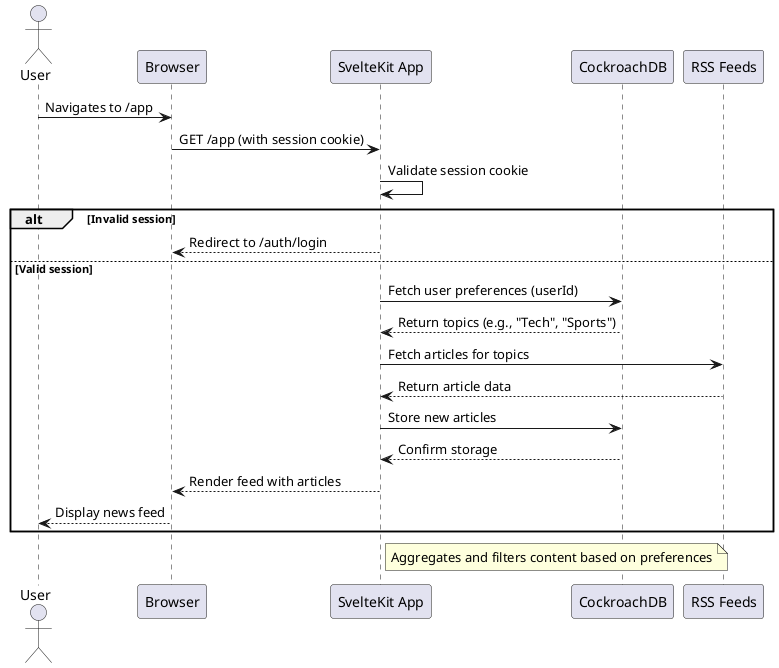

</details>

#### Explanation

- **Actors and Participants**: The User, Browser, SvelteKit App, CockroachDB, and RSS Feeds collaborate to deliver the news feed.
- **Flow**:
  1. The User navigates to `/app` via the Browser, sending a session cookie.
  2. The App validates the cookie; if invalid, it redirects to login; if valid, it proceeds.
  3. The App queries CockroachDB for the user’s preferences (e.g., topics like "Tech").
  4. Using these preferences, the App fetches relevant articles from RSS Feeds.
  5. New articles are stored in CockroachDB for persistence.
  6. The App renders the feed and sends it to the Browser for display.
- **Purpose**: This diagram highlights the news aggregation process, showing how Barn personalizes content and ensures fresh updates, aligning with its core mission.

## UML State Diagram

This UML State Diagram for Barn illustrates the possible states and transitions an object undergoes throughout its lifecycle within the system. For this section, we’ll focus on the **Article** object, as it’s central to Barn’s functionality,representing the news articles users interact with. This diagram shows how an article transitions through states based on system and user actions. Below is the PlantUML, followed by a detailed explanation.

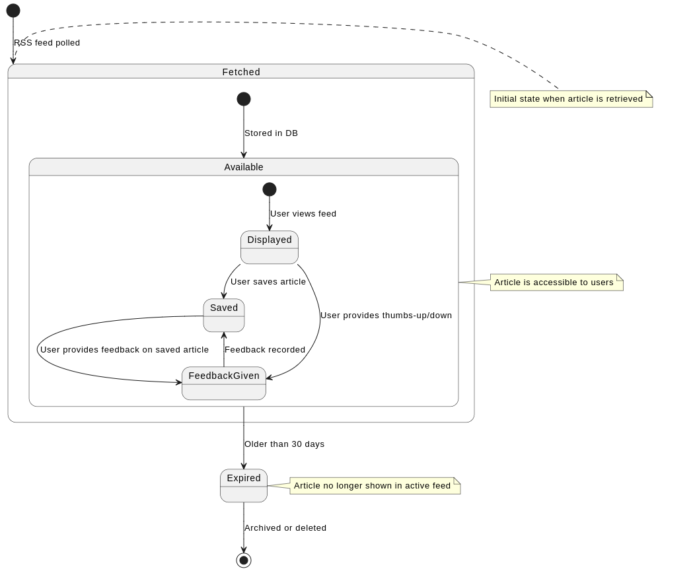

<details>
<summary>Click to Expand: PlantUML code</summary>

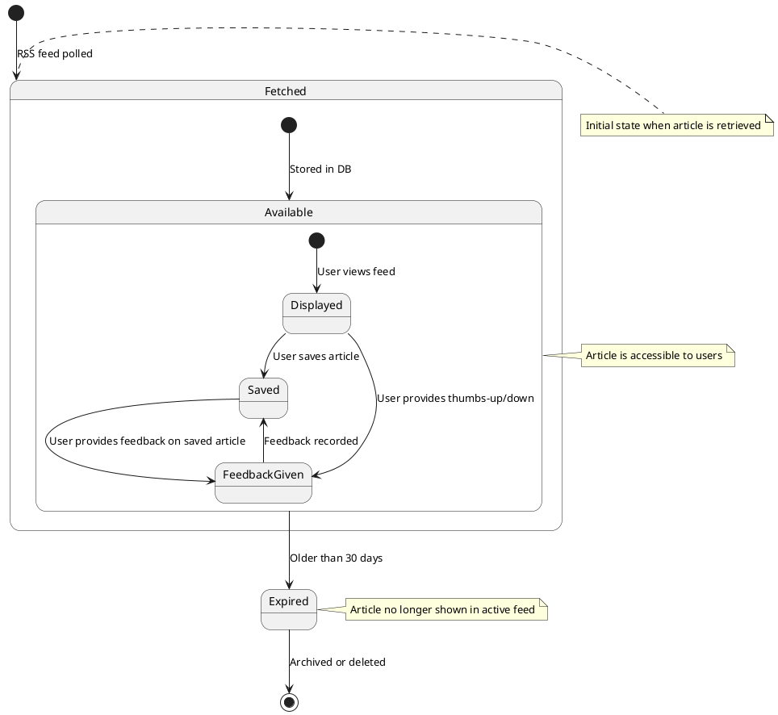

</details>

### Diagram Explanation

- **States**:

  - **Fetched**: The initial state when an article is retrieved from an RSS feed. This is a composite state with a sub-state:
    - **Available**: The article is stored in CockroachDB and ready for user access.
  - **Available**: The main active state where the article is part of the user’s feed. It includes sub-states:
    - **Displayed**: The article is shown in the user’s news feed.
    - **Saved**: The user has saved the article for later reading.
    - **FeedbackGiven**: The user has provided thumbs-up or thumbs-down feedback.
  - **Expired**: The article is older than 30 days and no longer appears in the active feed.

- **Transitions**:

  - **[*] --> Fetched**: Triggered when the system polls an RSS feed and retrieves a new article.
  - **Fetched --> Available**: Occurs when the article is successfully stored in the database.
  - **Available --> Displayed**: Happens when a user navigates to their feed and the article is rendered.
  - **Displayed --> Saved**: Initiated when the user saves the article.
  - **Displayed --> FeedbackGiven**: Occurs when the user provides feedback directly from the feed.
  - **Saved --> FeedbackGiven**: Triggered when the user provides feedback on a saved article.
  - **FeedbackGiven --> Saved**: Feedback is recorded, and the article remains saved.
  - **Available --> Expired**: Automatically occurs if the article is older than 30 days (configurable threshold).
  - **Expired --> [*]**: The article is archived or deleted, ending its lifecycle.

- **Notes**:
  - **Fetched**: Marks the entry point of an article into Barn’s system.
  - **Available**: Represents the article’s active lifecycle where user interactions occur.
  - **Expired**: Indicates the end of visibility to maintain a fresh feed.

## UML Activity Diagram (Swimlane Diagram)

This UML Activity Diagram with Swimlanes for Barn visually represents the activities and flows within a specific process, highlighting the responsibilities of different actors using swimlanes. For this section, we’ll focus on the **User Onboarding Process**, a critical workflow where new users sign in and set up their preferences. This diagram clarifies the sequence of steps and the roles of the User, SvelteKit App, Google OAuth, and CockroachDB. Below is the PlantUML , followed by a detailed explanation.

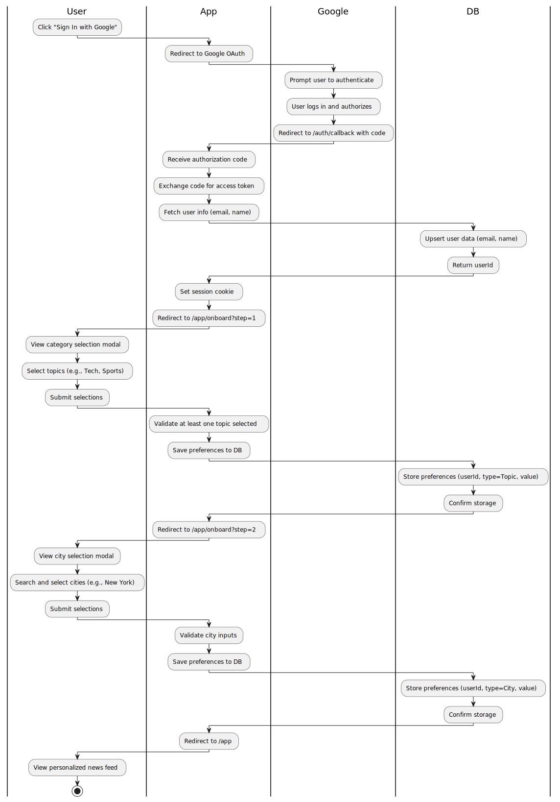

<details>
<summary>Click to Expand: PlantUML code</summary>

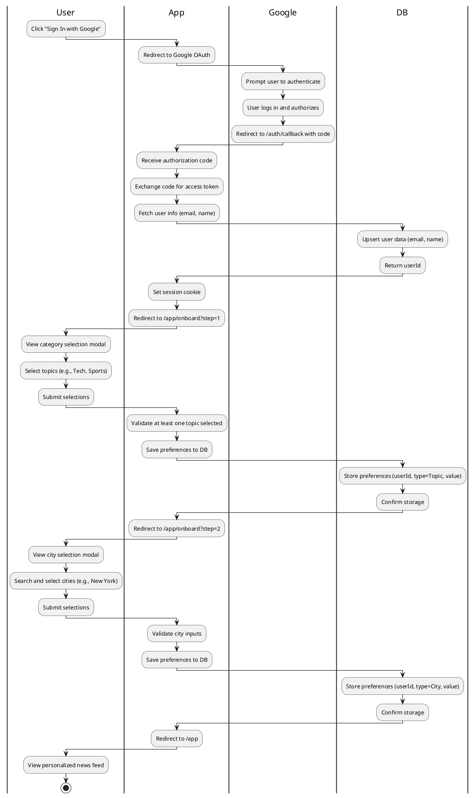

</details>

### Diagram Explanation

- **Swimlanes (Actors/Participants)**:

  - **User**: The end-user interacting with Barn during onboarding.
  - **SvelteKit App**: Barn’s core application handling logic, UI rendering, and data processing.
  - **Google OAuth**: The external authentication service.
  - **CockroachDB**: The database storing user data and preferences.

- **Activities and Flow**:

  1. **User**: Starts by clicking "Sign In with Google".
  2. **SvelteKit App**: Redirects to Google OAuth for authentication.
  3. **Google OAuth**: Prompts the user to log in, authorizes Barn, and redirects back with a code.
  4. **SvelteKit App**: Exchanges the code for an access token, fetches user info, and upserts it into CockroachDB.
  5. **CockroachDB**: Stores the user data and returns a `userId`.
  6. **SvelteKit App**: Sets a session cookie and redirects to the first onboarding step (`/app/onboard?step=1`).
  7. **User**: Selects topics (e.g., "Tech", "Sports") from a modal and submits them.
  8. **SvelteKit App**: Validates the selection (at least one topic required) and saves it to the database.
  9. **CockroachDB**: Stores the topic preferences and confirms.
  10. **SvelteKit App**: Redirects to the second step (`/app/onboard?step=2`).
  11. **User**: Searches and selects cities (e.g., "New York") and submits them.
  12. **SvelteKit App**: Validates the city inputs and saves them to the database.
  13. **CockroachDB**: Stores the city preferences and confirms.
  14. **SvelteKit App**: Redirects to the main feed (`/app`).
  15. **User**: Views their personalized news feed.

- **Transitions**: The arrows (`->`) indicate the flow between actors, showing a sequential process with clear handoffs (e.g., from User to App, App to DB).

## UML Component Diagram

This UML Component Diagram for Barn illustrates the system's physical components and their dependencies, providing a high-level architectural view. This diagram is crucial for understanding how Barn’s software modules interact and rely on external services.

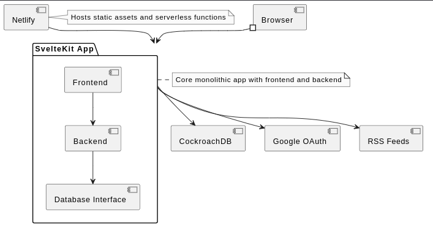

<details>
<summary>Click to Expand: PlantUML code</summary>

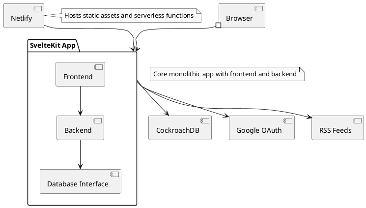

</details>

### Diagram Explanation

- **Components**:

  - **Browser**: The client interface where users access Barn.
  - **SvelteKit App**: The monolithic core, split into:
    - **Frontend**: Handles UI rendering (SSR and client-side).
    - **Backend**: Manages API endpoints, OAuth, and RSS feed aggregation.
    - **Database Interface**: Abstracts data access to CockroachDB.
  - **CockroachDB**: Distributed database for storing user data, preferences, and articles.
  - **Google OAuth**: External service for authentication.
  - **RSS Feeds**: External sources for news content.
  - **Netlify**: Hosting platform for static assets and serverless functions.

- **Dependencies**:

  - Browser interacts with SvelteKit App via HTTP.
  - SvelteKit App depends on CockroachDB for data persistence, Google OAuth for authentication, and RSS Feeds for content.
  - Netlify hosts the SvelteKit App, providing scalability.

## Cloud Deployment Diagram

The Cloud Deployment Diagram for Barn illustrates how its components are deployed on a cloud platform—here, Netlify and CockroachDB’s cloud offering—ensuring scalability and performance.

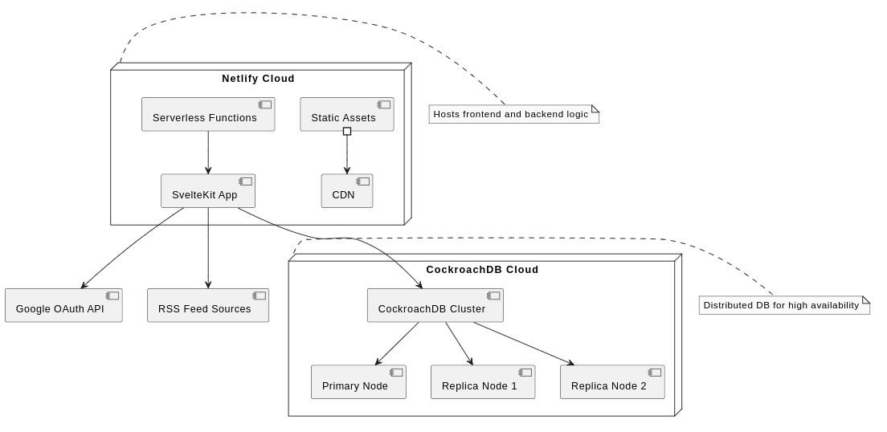

<details>
<summary>Click to Expand: PlantUML code</summary>

```plantuml
@startuml
skinparam monochrome true

node "Netlify Cloud" {
  [Static Assets] #--> [CDN]
  [Serverless Functions] --> [SvelteKit App]
}

node "CockroachDB Cloud" {
  [CockroachDB Cluster] --> [Primary Node]
  [CockroachDB Cluster] --> [Replica Node 1]
  [CockroachDB Cluster] --> [Replica Node 2]
}

[SvelteKit App] --> [CockroachDB Cluster]
[SvelteKit App] --> [Google OAuth API] #..#
[SvelteKit App] --> [RSS Feed Sources] #..#

note right of [Netlify Cloud]
  Hosts frontend and backend logic
end note

note right of [CockroachDB Cloud]
  Distributed DB for high availability
end note

@enduml
```

</details>

### Diagram Explanation

- **Netlify Cloud**:

  - **Static Assets**: Served via a CDN for fast global delivery.
  - **Serverless Functions**: Run SvelteKit’s backend logic (e.g., API endpoints).
  - **SvelteKit App**: Deployed here, handling both frontend and backend.

- **CockroachDB Cloud**:
  - **CockroachDB Cluster**: A distributed database with a primary node and replicas for redundancy and scalability.
- **External Services**:

  - **Google OAuth API**: Accessed for authentication (dotted line indicates external dependency).
  - **RSS Feed Sources**: Polled for news content.

---

## Skeleton Classes and Tables Definition

This section provides basic outlines of Barn’s main classes and database tables, serving as a foundation for implementation.

### Skeleton Classes

```typescript
// User.ts
class User {
  private userId: string;
  private email: string;
  private name: string;
  private createdAt: Date;

  constructor(email: string, name: string) {
    this.userId = generateUUID();
    this.email = email;
    this.name = name;
    this.createdAt = new Date();
  }

  public signInWithGoogle(): void {
    /* OAuth logic */
  }
  public getPreferences(): Preference[] {
    /* Fetch preferences */
  }
}

// Preference.ts
class Preference {
  private preferenceId: string;
  private userId: string;
  private type: "Topic" | "City";
  private value: string;

  constructor(userId: string, type: "Topic" | "City", value: string) {
    this.preferenceId = generateUUID();
    this.userId = userId;
    this.type = type;
    this.value = value;
  }
}

// Article.ts
class Article {
  private articleId: string;
  private title: string;
  private content: string;
  private sourceUrl: string;
  private publishedAt: Date;
  private rssFeedId: string;

  constructor(
    title: string,
    content: string,
    sourceUrl: string,
    rssFeedId: string
  ) {
    this.articleId = generateUUID();
    this.title = title;
    this.content = content;
    this.sourceUrl = sourceUrl;
    this.publishedAt = new Date();
    this.rssFeedId = rssFeedId;
  }

  public toAudio(): AudioStream {
    /* Convert to audio */
  }
}
```

### Database Tables

```sql
CREATE TABLE Users (
  userId STRING PRIMARY KEY,
  email STRING UNIQUE NOT NULL,
  name STRING NOT NULL,
  createdAt TIMESTAMP NOT NULL
);

CREATE TABLE Preferences (
  preferenceId STRING PRIMARY KEY,
  userId STRING REFERENCES Users(userId),
  type STRING CHECK (type IN ('Topic', 'City')),
  value STRING NOT NULL
);

CREATE TABLE Articles (
  articleId STRING PRIMARY KEY,
  title STRING NOT NULL,
  content TEXT NOT NULL,
  sourceUrl STRING NOT NULL,
  publishedAt TIMESTAMP NOT NULL,
  rssFeedId STRING REFERENCES RSSFeeds(rssFeedId)
);

CREATE TABLE RSSFeeds (
  rssFeedId STRING PRIMARY KEY,
  url STRING UNIQUE NOT NULL,
  name STRING NOT NULL,
  lastFetched TIMESTAMP
);
```

- **Explanation**:

  - Classes (e.g., `User`, `Preference`, `Article`) outline key attributes and methods in TypeScript, aligning with the Class Diagram.
  - Tables define the schema for CockroachDB, including primary/foreign keys and constraints (e.g., `UNIQUE` email), ensuring data integrity.

---

## Design Patterns

Barn incorporates several design patterns and best practices to enhance its quality, maintainability, and scalability. Below are the patterns used, with justifications.

### 1. Repository Pattern (GRASP)

- **Description**: Used in the backend to abstract data access logic, providing a consistent interface (e.g., `Database Interface`) between the SvelteKit App and CockroachDB.
- **Justification**: Simplifies database operations (e.g., upserting user data) and decouples business logic from storage, making it easier to switch databases or test in isolation.

### 2. Single Responsibility Principle (SOLID)

- **Description**: Each class/module has one responsibility (e.g., `User` handles authentication, `Article` manages content).
- **Justification**: Enhances maintainability by ensuring changes to one feature (e.g., feedback) don’t affect unrelated parts (e.g., feed aggregation).

### 3. Facade Pattern (GOF)

- **Description**: The SvelteKit App acts as a facade, simplifying interactions between the Browser, external services (Google OAuth, RSS Feeds), and CockroachDB.
- **Justification**: Reduces complexity for the frontend by providing a unified API (e.g., `/app` endpoint), improving usability for developers and users.

### 4. Observer Pattern (GOF) - Adapted

- **Description**: Implicitly used in the feedback system, where user ratings (thumbs-up/down) trigger updates to the recommendation engine.
- **Justification**: Enables dynamic content personalization, aligning with Barn’s goal of tailored news delivery.

- **Purpose**: These patterns ensure Barn is robust, modular, and adaptable, meeting course requirements while supporting its distraction-free, user-centric mission.
